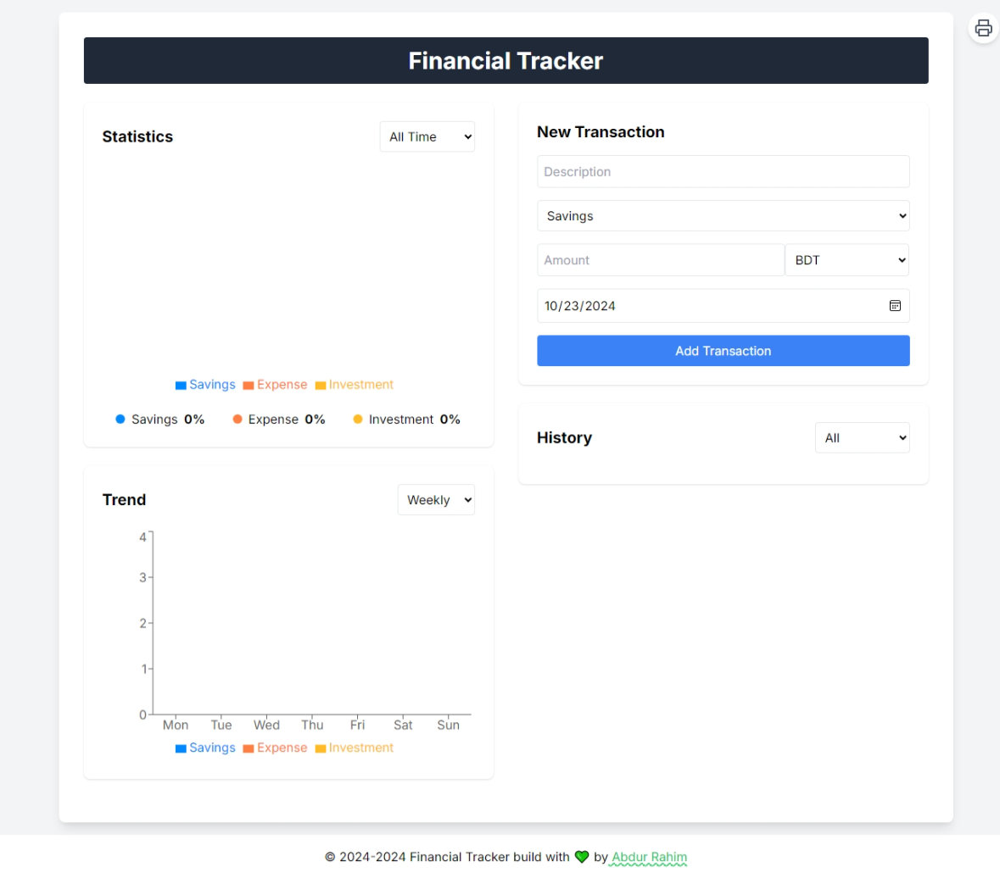

# Financial Tracker

A simple financial tracker app built with React, TypeScript, and Tailwind CSS.

### Prerequisites

- Node.js (v14 or later)
- npm or yarn

## Features

- Add and manage transactions with descriptions, amounts, categories, and dates.
- View balances for different categories (Savings, Expense, Current).
- Responsive design for mobile and desktop devices.
- Local storage for saving transactions.
- Currency selection for transactions. 
- Pie chart for visualizing transaction distribution by category. and bar chart for visualizing transaction distribution by date. and Filter transactions by category 
- Filter transactions by category

### Installation

1. Clone the repository:
   ```
   git clone https://github.com/AbdurRaahimm/Financial-Tracker.git
   ```

2. Navigate to the project directory:
   ```
   cd Financial-Tracker
   ```

3. Install dependencies:
   ```
   npm install
   ```
   or
   ```
   yarn install
   ```

4. Start the development server:
   ```
   npm run dev 
   ```
   or
   ```
   yarn run dev
   ```

5. Open your browser and visit `http://localhost:5173` to view the app.

## Features

1. Add transactions using the form with description, amount, category, and date. and select currency from the dropdown.
2. View your balances for different categories.
3. Use the statistics with pie chart and filter by week, month, or year.
4. View trends using the bar chart, which can be filtered by week, month, or year.
5. Filter transactions in the history section by category.
6. Update and Delete transactions from the history section.
7. Responsive design for mobile and desktop devices.
8. Print the transactions.

## Technologies Used

- Vite React
- TypeScript
- Tailwind CSS
- Recharts (for data visualization)
- Lucide React (for icons)

## Project Structure

- `src/components`: React components
- `src/types`: TypeScript type definitions
- `src/data`: Static data (e.g., currency list)


## Live Demo

[Live Demo](https://financial-tracker-abdurraahim.netlify.app/)

## Screenshots



